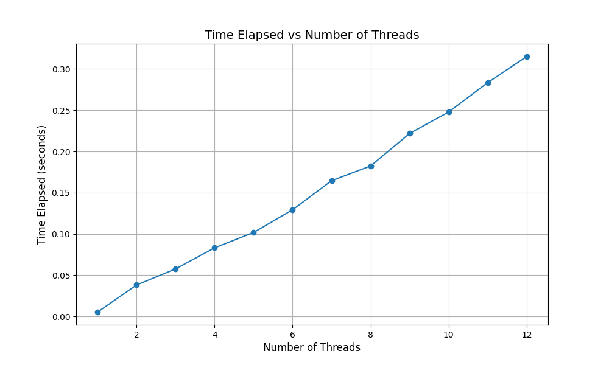

# Solutions

1) We'll start by redoing the measurements within this chapter. Use the call gettimeofday() to measure time within your program. How accurate is this timer? What is the smallest interval it can measure? Gain confidence in its workings, as we will need it in all subsequent questions. You can also look into other timers, such as the cycle counter available on x86 via the rdtsc instruction.

A: gettimeofday() returs time in seconds and microseconds, hence it is accurate to the nearest microsecond.

Use sysconf(_SC_NPROCESSORS_ONLN) to find the number of cores. Note that if your CPU has hyperthreading enabled, the total # of cores = virtual cores + physical cores, and virtual == physical.
My own (windows) PC's CPU is an AMD Ryzen 5 5600X 6-Core Processor with multithreading enabled, so I have 12 total cores. See below for what is multithreading.
 

2) Now, build a simple concurrent counter and measure how long it takes to increment the counter many times as the number of threads increases. How many CPUs are available on the system that you are using? Does this number impact your measurements at all?

A:

I have an AMD Ryzen 5 5600X 6-Core processor, with hyperthreading on (which doubles the number of cpu cores available), so total 12 threads. By setting the loop such that each thread has to update the shared variable 1 million times, the general trend reveals that as more threads are being used, the program's time elapsed is **greater**, i.e., more threads utilized results in program running slower.

As noted from the plot graph, as the number of threads utilized increases, the time taken for the program to complete actually increases. This is of course surprising, as it almost seems as if having a greater number of cores completely defeats the original purpose of having more cores in the first place - improved performance and concurrency!

<u>Expectation</u>

- When you increase the # of threads, the time might initially decrease or stay stable because multiple threads can execute concurrently on different cores. However, you are locking the shared counter using a mutex, so all threads need to wati for the lock to be released, causing contention.
- With more threads, each thread must frequently acquire and release the mutex lock to increment counter; locking overhead increases, leading to diminishing returns in performance. The more threads you add, the more they are likely to wait for the lock, which increases overall execution time.
- TIme should initially improve until point of saturation (# of threads > # of cores), at which point context switching between threads increases, adding to the overhead.

<u>Reality</u>

- For low thread count (1-4), time gradually increases. This is expected because even with a small number of threads, they need to wait for access to a shared resource (the counter), causing some contention.
- For 4 - 12 threads (beyond # of CPU cores), time increases more steeply. Hitting the point where adding more threads does not result in additional parallelism but instead adds more overhead (due to contention and CPU scheduling)
- Beyond that, even if you increase the number of threads, the performance will not improve or may even worsen due to all threads fighting over the same lock, resulting in increased synchronization overhead from `pthread_mutex_lock()` call.

3) Next, build a version of the approximate counter. Once again, measure its performance as the number of threads varies, as well as the threshold. Do the numbers match with what you see in the chapter?

A:

<u>Observations</u>

- Near Linear increase in time with more threads
    - As # of threads increase, the time required to complete the task increases almost linearly
    - This may seem surprising at first, as you might expect the approximate counter to reduce contention and improve performance when using multiple threads

<u>Possible reasons for near-linear increase</u>

1) Lock contention on global counter
- Even with an approximate counter, threads still need to access the global counter when their local counter reaches the threshold. This means that as more threads are added, they might still be hitting the global lcok frequently.

2) Simultaneous Multi-Threading (SMT) Overhead
- While SMT improves overall CPU utilization, each thread still shares resources (execution units, cache) with the other thread on the same core. As a result, performance gains from adding more threads diminish after you exceed the # of physical cores.
- After 6 threads, it is effectively sharing each physical core between 2 threads, which is why the time increases more steeply after that point.

Overall, trend is as expected, since resource sharing, context switching, and lock contention increases with more threads. However, I expected much better performance. The book shows that an approximation factor S of 1024 will result in a run time of very close to 0 seconds (around 0.0001). This was not achieved in my tests.

4) Build a version of the linked list that uses hand-over-hand locking as cited in the chapter. You should read the paper first to understand how it works, and then implement it. Measure its performance. When does a hand-over-hand list work better than a standard list as shown in the chapter?

Using a basic concurrent linked list with a single lock for the entire list in the program `concurrent-linked-list.c`, my machine took 0.000977s lookup list node key == 500000 

Using hand-over-hand linked list, my machine took 0.003222s to lookup list node key == 500000.

Clearly, hand-over-hand linked list performed worse than just using a single lock. This was very much expected, as the repeated lock acquisition and unlocking will result in expensive lock overheads.

A: When **concurrent traversal and modification of the list are frequent**.

1) **Frequent Insertions and Deletions at different positions**
E.g., Multiple threads need to insert or delete elements at various locations in the list.
<u>Basic Concurrent List Issue</u>: If global lock/coarse-grained locking is used, all threads would need to wait for the list to be fully unlocked, even if their operations affect different parts of the list
<u>Hand-Over-Hand List Advantage</u>: Allows threads to hold locks only on the portion of the list that they are traversing. Thus multiple thrreads can traverse and modify different parts of the list simulatenously without blocking each other, improving concurrency and reducing lock contention.

2) **Long Lists with Deep Traversal**
List is long and thread need to frequently traverse it to find elements
<u>Basic Concurrent List Issue</u>: Traversing list would require holding lock for entire operation, which could lead to significant blocking, especially for long lists. Threads that need to access elements near the end of the list would be delayed by other threads working at the beginning.
<u>Hand-Over-Hand List Advantage</u>: Each thread locks and unlocks individual nodes as it moves along the list, allowing other threads to traverse and modify unlocked parts of the list simultaneously. Improves performance in longer lists by allowing greater parallelism.

3) **Avoiding Lock Contention and Deadlock**
Multiple threads are traversing and modifying the list concurrently, with some operations requiring backtracking or long traversal paths.
<u>Basic Concurrent List Issue</u>: Basic Concurrent list that locks large sections of the list/entire list at once can suffer from increased lock contention, where multiple threads are forced to wait for a single lock, leading to reduced concurrency. It can also increase the risk of deadlock if threads attempt to acquire multiple locks at different points in the list.

<u>Hand-Over-Hand List Advantage</u>: In lock coupling, threads always hold only 2 adjacent locks (current node and next node), reducing lock contention. As each lock is released before acquiring the next, the chance of deadlock is minimized.

4) **Fine-Grained Access Control** 
List is frequently accessed by many threads performing both read and write operations.
<u>Basic Concurrent List Issue</u>: Threads are blocked even when they are working on completely independent parts of the list from other threads as the entire list only uses a single lock/a single lock per node.
<u>Hand-Over-Hand List Advantage</u>: Finer control while locking, as threads only lock the portion of the list they are currently working on. This increases the opportunity for other threads to operate concurrently on different parts of the list.

5) **Concurrent Traversal and Modification of Adjacent Nodes**
Multiple threads are likely to work on adjacent nodes, suc as when performing adjacent inserts or deletes.
<u>Basic Concurrent List Issue</u>: Might require locking large sections of the list, even for operations that affect only adjacent nodes, leading to unnecessary blocking.
<u>Hand-Over-Hand List Advantage</u>: With lock coupling, threads can traverse and modify adjacent nodes safely by holding locks on pairs of adjacent nodes. This allows for concurrrent traversal and modification in close proximity without needing to block the entirer list or large sections of it.

**When Hand-Over-Hand Locking is Less Effective?**
1) <u>Read-Heavy Workloads</u>: Basic concurrent list with a **read-write lock** might be more efficient, since hand-over-hand locking introduces more locking overrhead that could slow down purely read operations.
2) <u>Short Lists</u>: If list is short, or if operations mostly occur at head of list, overhead of lock coupling may outweigh its benefits. In these cases, a simple coarse-grained lock or single-lock strategy might be faster and simpler to implement.

5) Pick your favourite data structure, such as B-tree or other slightly more interesting structure. Implement it, and start with a simple locking strategy such as a single lock. Measure its performance as the number of concurrent threads increases.

A:
I pick B-tree. From wikipedia: "B-tree is a self-balancing tree data structure that maintains sorted data and allows searches, sequential access, insertions, deletions in logarithmic time. The B-tree generalizes the binary search tree, allowing for nodes with more than 2 children. Unlike other self-balancing binary search trees, the B-tree is well suited for storage systems that read and write relativeyly large blocks of data, such as databases and file systems."

Using the `b-tree-simple.c` program, my machine took 0.000006s to insert all of those nodes.

6) Finally, think of a more interesting locking strategy for this favourite data structure of yours. Implement it, and measure its performance. How does it compare to the straightforward locking apprroach?

A: We can implement **concurrent locking** or **lock coupling**, which are strategies that allow multiple threads to access different parts of the B-tree simulatenously, improving concurrency and performance.

Here are some advanced locking strategies that I have gathered:

1) **Node-Level Locking (Fine-Grained Locking)**
- Instead of locking the entire B-tree, each node has its own lock. Different threads can then work on different parts of the tree concurrently.
- Read locks can be used for searching, while write locks are needed for inserting/deleting. This is much more efficient than locking the entire structure.
+ : Increased concurrency, as threads working on different parts of the trees don't block each other.
- : Cons: More complex to implement, as it requires managing locks for multiple nodes

2) **Lock Coupling (Hand-over-Hand locking)**
- Thread locks a node and its parent simulatenously when moving down the tree. As thread moves to the next node, it releases the lock on the parent while acquiring the lock on the next node.
- Ensures safety and correctness
+ : Provides a good balance between performance and safety
- : Lock acquisition and release overhead can still be significant, especially for deep trees.

3) **Optimistic Concurrency Control**
- Allows threads to traverse B-tree without acquiring locks initially. Instead, they check if the structure they've read changes before making modifications (via a version number or timestamp mechanism)
- If conflict is detected, the operation is retried.
+ : High performance in read-heavy workloads or situations where conflicts are rare.
- : Threads may need to retry operations in case of contention, which could downgrade performance under high write contention.

4) **Lock-Free B-Trees (Optimistic Lock-Free Algorithms)**
- Use atomic operations (like CAS - Compare And Swap) to ensure that updates to the B-trees are done safely without locking
- Lock-free B-trees allow threads to operate concurrently for locks to be released, even under high contention. 
+ : Extremely high concurrency, especially for read-heavy workloads
- : Very complex to implement and maintain, with subtle bugs related to memory consistency models being harder to detect.

5) **Reader-Writer Locks**
- Variation of fine-grained locking. Uses reader-writer locks at the node level to allow muliple readers to access the same node concurrently but enforcing exclusivity for writers.
+ : More concurrency for read-heavy operations
- : Complex lock management and potential forr reader-writer prriority inversion, where a long series of reads can starve writers

6) **Range Locking**
- In cases where B-trees support range queries, lock entire ranges of keys rather than individual nodes
- Allows threads to operate on non-overlapping key ranges concurrently while still ensuring consistency for range queries.
+ : Better scalability for range queries, especially if ranges can be processed independetly
- : Complex lock management when ranges overlap

As you can observe from the program `b-tree-hand-over-hand.c`, I chose to implemented hand-over-hand locking on the B-tree.
Now, time taken to perform all operations: 0.000006s
A simple analysis will reveal that hand-over-hand locking did not result in any performance issues - but this is due to my B-tree implementation being very shallow (only max depth of 5). Hence, this hand-over-hand B-Tree will be able to enjoy the benefits of hand-over-hand locking - namely, safety and correctness - without suffering from performance degradation. However, the same likely can't be said for a B-Tree with greater depth.

<u>What is multithreading?</u>
- Intel's trademarked "Hyperthreading"; AMD calls it "Simultaneous Multi-Threading". They are both essentially the same thing. Multithreading is the broader term referring to that encompasses SMT, Hyperthreading, but also coarse-grained things like "switch on stall" or in-order barrel processors. You can refer to Wikipedia to find out more about multithreading.

